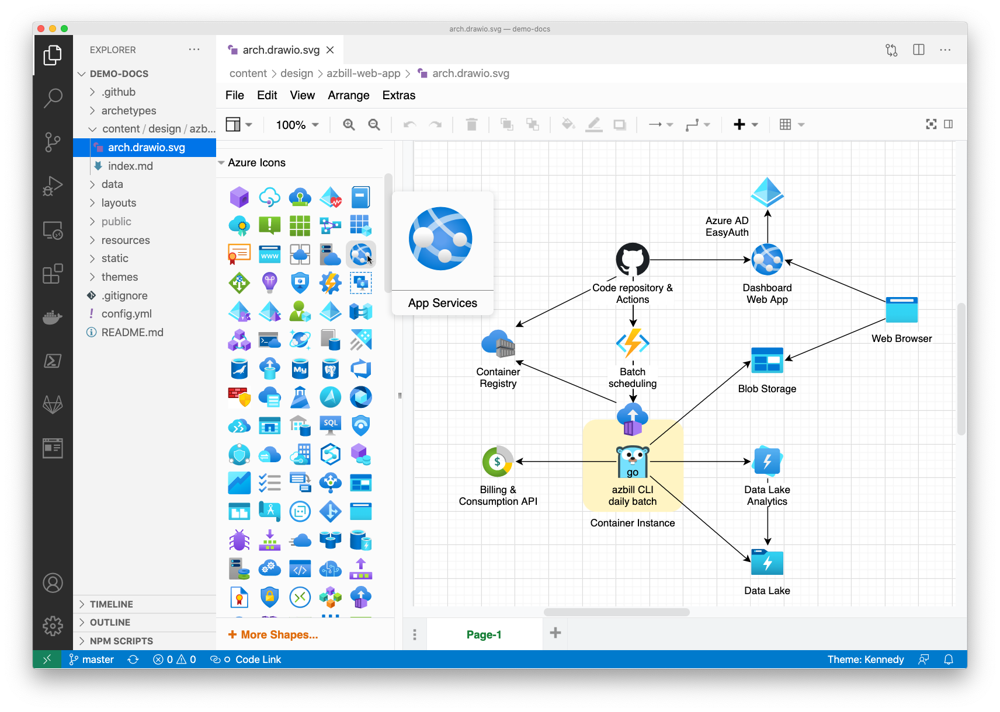

# Azure Icon Collection mxlibrary for diagrams.net (formerly draw.io)

## Introduction

This repository contains several mxlibrary sets converted from [Azure Icon Collection](https://code.benco.io/icon-collection/),
which is prepared for use as shape libraries on [diagrams.net](https://diagrams.net) (formerly draw.io) application.
You can easily import them into your documents on the app of online / desktop / VSCode extension versions.

The [svg2mxlibrary](svg2mxlibrary) program which I used to convert SVG icons into an XML file is also available.

## How to use

The generated mxlibrary files are stored in `mxlibrary` branch in the repository.
You can get them [via GitHub web site](https://github.com/yaegashi/icon-collection-mxlibrary/tree/mxlibrary).

To open [app.diagrams.net](https://app.diagrams.net) with the mxlibrary imported, use the following links.
The mxlibrary imported will be persisted.

|Icon Galleries|Links|
|---|---|
|['Official' Azure Icons Set](https://code.benco.io/icon-collection/azure-icons)|[Open app.diagrams.net with azure-icons.xml](https://app.diagrams.net/?splash=0&clibs=Uhttps%3A%2F%2Fraw.githubusercontent.com%2Fyaegashi%2Ficon-collection-mxlibrary%2Fmxlibrary%2Fazure-icons.xml)|
|[Azure Docs](https://code.benco.io/icon-collection/azure-docs)|[Open app.diagrams.net with azure-docs.xml](https://app.diagrams.net/?splash=0&clibs=Uhttps%3A%2F%2Fraw.githubusercontent.com%2Fyaegashi%2Ficon-collection-mxlibrary%2Fmxlibrary%2Fazure-docs.xml)|
|['CDS' Azure Icons Set](https://code.benco.io/icon-collection/azure-cds)|[Open app.diagrams.net with azure-cds.xml](https://app.diagrams.net/?splash=0&clibs=Uhttps%3A%2F%2Fraw.githubusercontent.com%2Fyaegashi%2Ficon-collection-mxlibrary%2Fmxlibrary%2Fazure-cds.xml)|
|[Azure Patterns Collection](https://code.benco.io/icon-collection/azure-patterns)|[Open app.diagrams.net with azure-patterns.xml](https://app.diagrams.net/?splash=0&clibs=Uhttps%3A%2F%2Fraw.githubusercontent.com%2Fyaegashi%2Ficon-collection-mxlibrary%2Fmxlibrary%2Fazure-patterns.xml) (watch out, >1500 icons!)|
|[Logos & Brands](https://code.benco.io/icon-collection/logos)|[Open app.diagrams.net with logos.xml](https://app.diagrams.net/?splash=0&clibs=Uhttps%3A%2F%2Fraw.githubusercontent.com%2Fyaegashi%2Ficon-collection-mxlibrary%2Fmxlibrary%2Flogos.xml)|
|[Other Icons](https://code.benco.io/icon-collection/other)|[Open app.diagrams.net with other.xml](https://app.diagrams.net/?splash=0&clibs=Uhttps%3A%2F%2Fraw.githubusercontent.com%2Fyaegashi%2Ficon-collection-mxlibrary%2Fmxlibrary%2Fother.xml)|

To use the mxlibrary with [the desktop app](https://github.com/jgraph/drawio-desktop),
you should first [download mxlibrary files](https://github.com/yaegashi/icon-collection-mxlibrary/archive/mxlibrary.zip),
then drag and drop XML files on the app.

To use the mxlibrary as custom libraries with
[Visual Studio Code Draw.io Integration](https://marketplace.visualstudio.com/items?itemName=hediet.vscode-drawio),
add the following snippet in your settings.json.

```json
    "hediet.vscode-drawio.customLibraries": [
        {
            "entryId": "'Official' Azure Icons Set",
            "libName": "Azure Icons",
            "url": "https://raw.githubusercontent.com/yaegashi/icon-collection-mxlibrary/mxlibrary/azure-icons.xml"
        },
        {
            "entryId": "Azure Docs",
            "libName": "Azure Docs",
            "url": "https://raw.githubusercontent.com/yaegashi/icon-collection-mxlibrary/mxlibrary/azure-docs.xml"
        },
        {
            "entryId": "'CDS' Azure Icons Set",
            "libName": "Azure CDS",
            "url": "https://raw.githubusercontent.com/yaegashi/icon-collection-mxlibrary/mxlibrary/azure-cds.xml"
        },
        {
            "entryId": "Azure Patterns Collection",
            "libName": "Azure Pattenrs",
            "url": "https://raw.githubusercontent.com/yaegashi/icon-collection-mxlibrary/mxlibrary/azure-patterns.xml"
        },
        {
            "entryId": "Logos & Brands",
            "libName": "Azure Logos",
            "url": "https://raw.githubusercontent.com/yaegashi/icon-collection-mxlibrary/mxlibrary/logos.xml"
        },
        {
            "entryId": "Other Icons",
            "libName": "Azure Other",
            "url": "https://raw.githubusercontent.com/yaegashi/icon-collection-mxlibrary/mxlibrary/other.xml"
        },
    ],
```



## How to convert SVG icons to mxlibrary

You need to have [Node.js](https://nodejs.org) to build and run [svg2mxlibrary](svg2mxlibrary).

You can run [convert.sh](convert.sh) to clone <https://github.com/benc-uk/icon-collection>
and convert icon collection folders into mxlibrary files in "out" directory.

```console
$ npm install --no-save svg2mxlibrary
$ ./convert.sh
Cloning into 'icon-collection'...
remote: Enumerating objects: 2842, done.
remote: Counting objects: 100% (2842/2842), done.
remote: Compressing objects: 100% (2739/2739), done.
remote: Total 2842 (delta 153), reused 1216 (delta 99), pack-reused 0
Receiving objects: 100% (2842/2842), 1.72 MiB | 1.95 MiB/s, done.
Resolving deltas: 100% (153/153), done.
Generating mxlibrary out/azure-icons.xml
Generating mxlibrary out/azure-docs.xml
Generating mxlibrary out/azure-cds.xml
Generating mxlibrary out/azure-patterns.xml
Generating mxlibrary out/logos.xml
Generating mxlibrary out/other.xml
```

## Credits

- [Azure Icon Collection](https://github.com/benc-uk/icon-collection) by [benc-uk](https://github.com/benc-uk) for the great icon set collection we all benefit from.
- [Azure Icon Libraries for Diagrams.net (Draw.io)](https://github.com/pacodelacruz/diagrams-net-azure-libraries) by [pacodelacruz](https://github.com/pacodelacruz) directly inspires me to make this mxlibrary repository with the latest Azure Icon Collection.
- [How i can use mxGraph instance in node.js](https://stackoverflow.com/q/55711473/4937930) is a Stack Overflow question that was a critical clue for me to successfully develop [svg2mxlibrary](svg2mxlibrary).

## Ownership & copyright

I do not attribute ownership to any of icons and images in [mxlibrary branch](https://github.com/yaegashi/icon-collection-mxlibrary/tree/mxlibrary).
No copyright infringement is intended.
All files have been sourced from [Azure Icon Collection](https://github.com/benc-uk/icon-collection) by [benc-uk](https://github.com/benc-uk),
which in turn were collected by scraping the public internet and various Microsoft sites.
They are compiled into mxlibrary files under fair use.

[svg2mxlibrary](svg2mxlibrary) is copyrighted under MIT license by [yaegashi](https://github.com/yaegashi).
